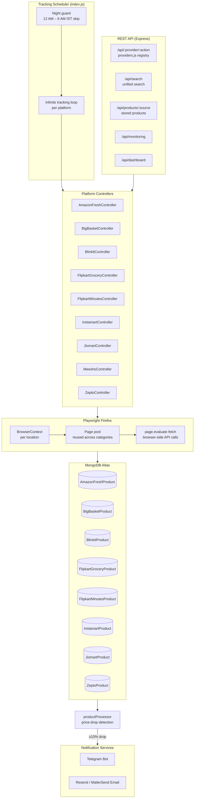

# Sasta Signals — Multi-Platform Price Tracking & Alerts

Sasta Signals continuously monitors product prices across major Indian quick-commerce and grocery platforms and sends real-time Telegram alerts when prices drop significantly.

## 🌐 Deployment

| Component     | Location                                   |
| ------------- | ------------------------------------------ |
| Backend       | DigitalOcean Droplet — `68.183.85.22:8000` |
| Reverse Proxy | Nginx — `https://68.183.85.22/`            |
| Database      | MongoDB Atlas                              |

---

## 🏗️ Architecture



---

## 🚀 Features

- **9 platforms** — Amazon Fresh, BigBasket, Blinkit, Flipkart Grocery, Flipkart Minutes, Instamart, JioMart, Meesho, Zepto
- **Browser-side API calls** — `page.evaluate(fetch())` for platforms that use CDN-routed or session-authenticated APIs (Blinkit, Flipkart Minutes)
- **Cloudflare 403 handling** — automatic page reload + retry on rate-limited responses
- **Smart context reuse** — one Playwright `BrowserContext` per location, single page reused across all categories per cycle
- **Night guard** — tracking pauses 12 AM – 6 AM IST
- **Telegram alerts** — fires when price drops ≥ 10% vs stored price
- **Unified search** — single endpoint queries all platforms simultaneously
- **Dynamic provider routing** — adding a new platform requires only a controller + one registry entry

---

## 🏛️ Project Structure

```
deals-checker/
├── backend/
│   ├── index.js                    # Server entry, tracking bootstrapper
│   └── src/
│       ├── controllers/            # One file per platform
│       │   ├── AmazonFreshController.js
│       │   ├── BigBasketController.js
│       │   ├── BlinkitController.js
│       │   ├── FlipkartGroceryController.js
│       │   ├── FlipkartMinutesController.js
│       │   ├── InstamartController.js
│       │   ├── jiomartController.js
│       │   ├── MeeshoController.js
│       │   ├── UnifiedSearchController.js
│       │   └── ZeptoController.js
│       ├── models/                 # Mongoose schemas, one per platform
│       ├── routes/api/
│       │   ├── providers.js        # Dynamic /:provider/:action router
│       │   ├── search.js           # Unified search
│       │   ├── products.js         # Stored product queries
│       │   ├── monitoring.js       # System health
│       │   └── dashboard.js        # Visual monitoring UI
│       ├── services/
│       │   └── NotificationService.js
│       └── utils/
│           ├── contextManager.js   # Playwright context lifecycle
│           ├── productProcessor.js # Price-drop detection & DB upsert
│           ├── priceTracking.js    # Night guard, discount helpers
│           ├── logger.js           # Winston logger
│           └── errorHandling.js
└── frontend/                       # Next.js 14 frontend
```

---

## 📱 API Endpoints

### Provider routes — `/api/:provider/:action`

All platform routes share a single dynamic router. Supported combinations:

| Provider           | `track` | `search` | Other                |
| ------------------ | ------- | -------- | -------------------- |
| `amazon-fresh`     | ✅ POST | —        | —                    |
| `bigbasket`        | ✅ POST | —        | GET `categories`     |
| `blinkit`          | ✅ POST | ✅ POST  | —                    |
| `flipkart-grocery` | ✅ POST | ✅ POST  | —                    |
| `flipkart-minutes` | ✅ GET  | ✅ POST  | —                    |
| `instamart`        | ✅ POST | ✅ POST  | —                    |
| `jiomart`          | ✅ POST | —        | —                    |
| `meesho`           | —       | ✅ GET   | —                    |
| `zepto`            | ✅ POST | —        | —                    |

### Other routes

| Method | Path                       | Description                          |
| ------ | -------------------------- | ------------------------------------ |
| GET    | `/api/search?q=&location=` | Unified search across all platforms  |
| GET    | `/api/:provider/products`  | Fetch stored products for a platform |
| GET    | `/api/deals/all`           | All active deals across platforms    |
| GET    | `/api/monitoring`          | System health & context status       |
| GET    | `/api/dashboard`           | Visual monitoring dashboard          |

---

## 🛠️ Tech Stack

### Backend

| Package             | Purpose                                      |
| ------------------- | -------------------------------------------- |
| Express.js          | REST API framework                           |
| Playwright          | Browser automation (Firefox)                 |
| Mongoose            | MongoDB ODM                                  |
| Axios               | HTTP client (Meesho, BigBasket category API) |
| Winston             | Structured logging                           |
| Resend / MailerSend | Email notifications                          |
| dotenv              | Environment config                           |

### Frontend

| Package      | Purpose               |
| ------------ | --------------------- |
| Next.js 14   | React framework       |
| Tailwind CSS | Utility-first styling |
| Material-UI  | Component library     |

---

## 📦 Setup

### Prerequisites

- Node.js v18+
- pnpm
- MongoDB instance
- Playwright Firefox: `npx playwright install firefox`

### Environment Variables

Create `backend/.env`:

```env
MONGO_URI=mongodb+srv://...
DB_NAME=product-tracker

TELEGRAM_BOT_TOKEN=...
TELEGRAM_CHANNEL_ID=@channelname

RESEND_API_KEY=...

# BigBasket session cookie (required for category fetching)
BIGBASKET_COOKIE=your_bigbasket_cookie_string

ENVIRONMENT=development   # or production
PORT=8000
```

### Run

```bash
# Backend
cd backend && pnpm install && pnpm start

# Frontend
cd frontend && pnpm install && pnpm dev
```

---

## ⚙️ How Price Tracking Works

1. **Location setup** — Playwright navigates to the platform, enters the pincode/address, and confirms delivery availability. The `BrowserContext` is cached so this only runs once per location.
2. **Category discovery** — Categories are fetched (via API or DOM scraping depending on platform) and shuffled to distribute load.
3. **Product extraction** — For each category, products are fetched using `page.evaluate(fetch())` so the browser's DNS, cookies, and session are used directly. This bypasses Node.js DNS issues with CDN-routed API endpoints.
4. **Price-drop detection** — `productProcessor` upserts each product into MongoDB. If the new price is ≥ 10% lower than the last stored price, a Telegram notification is fired.
5. **Loop** — After all categories are processed, the cycle restarts. Night hours (12 AM – 6 AM IST) are skipped automatically.

---

## 📄 License

ISC License — for personal and educational use. Ensure compliance with each platform's Terms of Service.

## 🌐 Current Deployment

- **Backend**: DigitalOcean Droplet (68.183.85.22:8000)
- **Proxy**: Nginx reverse proxy (https://68.183.85.22/)
- **Database**: MongoDB (cloud or self-hosted)

## 🚀 Features

### Multi-Platform Support

- **Instamart** (Swiggy) - Quick grocery delivery
- **BigBasket** - Online grocery supermarket
- **Blinkit** - Instant grocery delivery
- **Zepto** - 10-minute grocery delivery
- **Amazon Fresh** - Amazon's grocery service
- **Flipkart Grocery** - Flipkart's grocery platform
- **Meesho** - Social commerce platform

### Core Functionality

- ✅ **Automated Price Tracking** - Continuous monitoring of product prices
- ✅ **Location-based Services** - Support for different pincodes/delivery areas
- ✅ **Smart Notifications** - Telegram and email alerts for significant price drops
- ✅ **Real-time Updates** - Live price comparison across platforms
- ✅ **Category-wise Tracking** - Organized tracking by product categories
- ✅ **Discount Detection** - Automatic detection of deals and offers
- ✅ **Stock Monitoring** - Track product availability

## 🏗️ Architecture

### Backend (Node.js/Express)

- **Web Scraping**: Playwright with Firefox automation
- **Database**: MongoDB with platform-specific collections
- **API**: RESTful endpoints for product search and tracking
- **Notifications**: Telegram Bot API and Resend email service
- **Context Management**: Efficient browser context reuse

### Frontend (Next.js/React)

- **UI Framework**: Next.js 14 with React 18
- **Styling**: Tailwind CSS with dark/light theme support
- **Components**: Material-UI integration
- **State Management**: React hooks and context

### Database Schema

Each platform has its own MongoDB collection with fields:

- Product identification (productId, productName)
- Pricing information (price, mrp, discount, previousPrice)
- Category data (categoryName, subcategoryName)
- Tracking metadata (priceDroppedAt, lastChecked, inStock)
- Product details (imageUrl, url, weight, brand)

## 🛠️ Technology Stack

### Backend Dependencies

- **Express.js** - Web framework
- **Mongoose** - MongoDB ODM
- **Playwright** - Browser automation
- **Axios** - HTTP client
- **Resend** - Email service
- **MailerSend** - Alternative email service
- **CORS** - Cross-origin resource sharing
- **dotenv** - Environment configuration

### Frontend Dependencies

- **Next.js 14** - React framework
- **React 18** - UI library
- **Tailwind CSS** - Utility-first CSS
- **Material-UI** - Component library
- **React Icons** - Icon library
- **Axios** - API client

## 📦 Installation & Setup

### Prerequisites

- Node.js (v18 or higher)
- MongoDB database
- pnpm or npm package manager

### Backend Setup

```bash
cd backend
pnpm install
# or npm install

# Setup Playwright browsers
npx playwright install

# Configure environment variables
cp .env.example .env
# Edit .env with your configuration
```

### Frontend Setup

```bash
cd frontend
pnpm install
# or npm install
```

### Environment Variables

Create `.env` file in backend directory:

```env
# Database
MONGO_URI=mongodb://localhost:27017/sasta-signals

# Notifications
TELEGRAM_BOT_TOKEN=your_telegram_bot_token
TELEGRAM_CHANNEL_ID=your_telegram_channel_id
RESEND_API_KEY=your_resend_api_key

# BigBasket session cookie (required for category fetching)
BIGBASKET_COOKIE=your_bigbasket_cookie_string

# Environment
ENVIRONMENT=development
PORT=8000
```

## 🚀 Running the Application

### Development Mode

```bash
# Backend
cd backend
pnpm dev

# Frontend (in another terminal)
cd frontend
pnpm dev
```

### Production Mode

```bash
# Backend
cd backend
pnpm start

# Frontend
cd frontend
pnpm build
pnpm start
```

## 🌐 Deployment Commands

```bash
# Build frontend
cd frontend && pnpm build

# Start backend in production
cd backend && pnpm start
```

## 📱 API Endpoints

### Product Search

- `POST /api/{platform}/search` - Search products on specific platform
- `GET /api/products/{platform}` - Get tracked products from platform

### Price Tracking

- `POST /api/{platform}/start-tracking` - Start price tracking
- `GET /api/{platform}/categories` - Get platform categories

### Supported Platforms

- `/api/instamart/*` - Instamart endpoints
- `/api/bigbasket/*` - BigBasket endpoints
- `/api/blinkit/*` - Blinkit endpoints
- `/api/zepto/*` - Zepto endpoints
- `/api/amazon-fresh/*` - Amazon Fresh endpoints
- `/api/flipkart-grocery/*` - Flipkart Grocery endpoints
- `/api/meesho/*` - Meesho endpoints

## 🔧 Configuration

### Browser Settings

- **User Agent**: iPad emulation for better compatibility
- **Viewport**: 1280x1024 (iPad portrait)
- **Memory Optimization**: Reduced cache and process limits
- **Context Management**: Maximum 3 concurrent contexts

### Tracking Settings

- **Night Mode**: Pauses tracking between 12 AM - 6 AM IST
- **Retry Logic**: 3 attempts with exponential backoff
- **Batch Processing**: Parallel processing with rate limiting
- **Notification Threshold**: 10% minimum discount for alerts

## 📊 Monitoring & Notifications

### Telegram Notifications

- Real-time price drop alerts
- Product availability updates
- Daily tracking summaries

### Email Notifications

- Weekly price reports
- Significant deal alerts
- System status updates

## 🔍 How It Works

### Price Tracking Process

1. **Location Setup**: Configure delivery location using pincode
2. **Category Scanning**: Automatically discover product categories
3. **Product Extraction**: Extract product details using web scraping
4. **Price Monitoring**: Continuously track price changes
5. **Notification System**: Alert users about significant price drops
6. **Data Storage**: Store historical pricing data for analysis

### Platform-Specific Features

- **Instamart**: Category-based tracking with subcategory support
- **BigBasket**: API-based product fetching with location validation
- **Blinkit**: Infinite scroll handling for complete product discovery
- **Zepto**: Sitemap-based category discovery
- **Amazon Fresh**: Search-based product tracking
- **Flipkart Grocery**: Query-based product search
- **Meesho**: Social commerce product tracking

## 🤝 Contributing

1. Fork the repository
2. Create a feature branch
3. Make your changes
4. Add tests if applicable
5. Submit a pull request

## 📄 License

This project is licensed under the ISC License.

## 🆘 Support

For issues and questions:

1. Check the existing issues
2. Create a new issue with detailed description
3. Include logs and error messages

## 🔮 Future Enhancements

- [ ] Mobile app development
- [ ] Price prediction using ML
- [ ] User accounts and wishlists
- [ ] Advanced filtering and sorting
- [ ] API rate limiting and caching
- [ ] Performance monitoring dashboard
- [ ] Multi-language support
- [ ] Price history charts and analytics
- [ ] Wishlist and favorites functionality
- [ ] Push notifications for mobile
- [ ] Integration with more platforms
- [ ] Advanced search and filtering options

## 📈 Project Statistics

- **Platforms Supported**: 7 major e-commerce platforms
- **Product Categories**: 100+ categories across platforms
- **Database Collections**: 7 platform-specific collections
- **API Endpoints**: 20+ RESTful endpoints
- **Notification Channels**: Telegram + Email
- **Browser Automation**: Playwright with Firefox
- **Deployment**: Production-ready on DigitalOcean

---

**Note**: This application is designed for educational and personal use. Please ensure compliance with the terms of service of the platforms being tracked.
